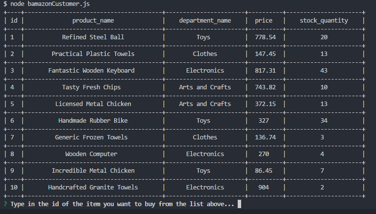
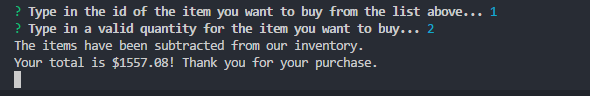
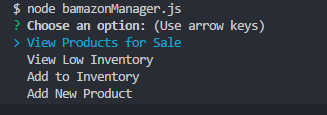
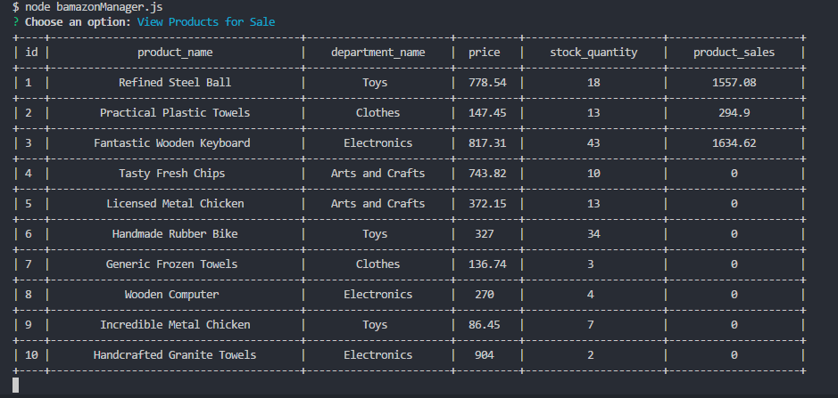
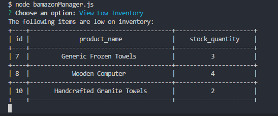
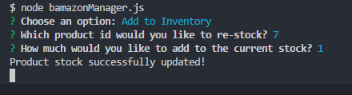
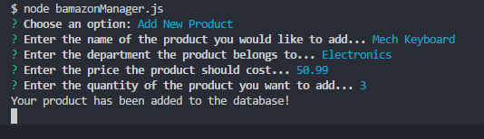
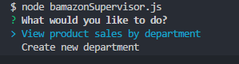
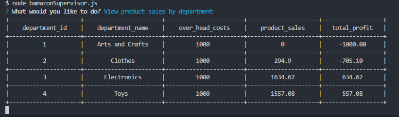

# Description
This project is a mock store front using the command line.
## Tech Used
* Node.js
* MySQL
# Customer View
You can see the customer view by typing:
```
node bamazonCustomer.js
```

1) You should get a table displayed showing the products for sale
2) You will get a prompt after asking you which product you would like to buy and how much of that proudct.
3) Enter the ```id``` number into the console of the proudct you want to buy and then enter a quantity.
4) It return your total price and then reflect the changes to the database as well.



# Manager View
You can see the manager view by typing:
```
node bamazonManger.js
```

* You will get a 4 menu options to choose from
## View Products for Sale
* Shows all availble products and their quantities.

## View Low Inventory
* Displays products with an inventory count lower than 5.

## Add to Inventory 
* Prompts user to select an item from the products list and add more of the item. 

## Add New Product
* Prompts user to input details for a new product and apply it to the database.


# Supervisor View
You can see the manager view by typing:
```
node bamazonSupervisor.js
```

* You have two menu options to choose from.
## View Product Sales by Department
* Displays a supervisor-specific table that shows the total profit calculated from the overhead cost and sales.

## Create New Department
* User is prompted to input a department name and overhead costs for that department. 
